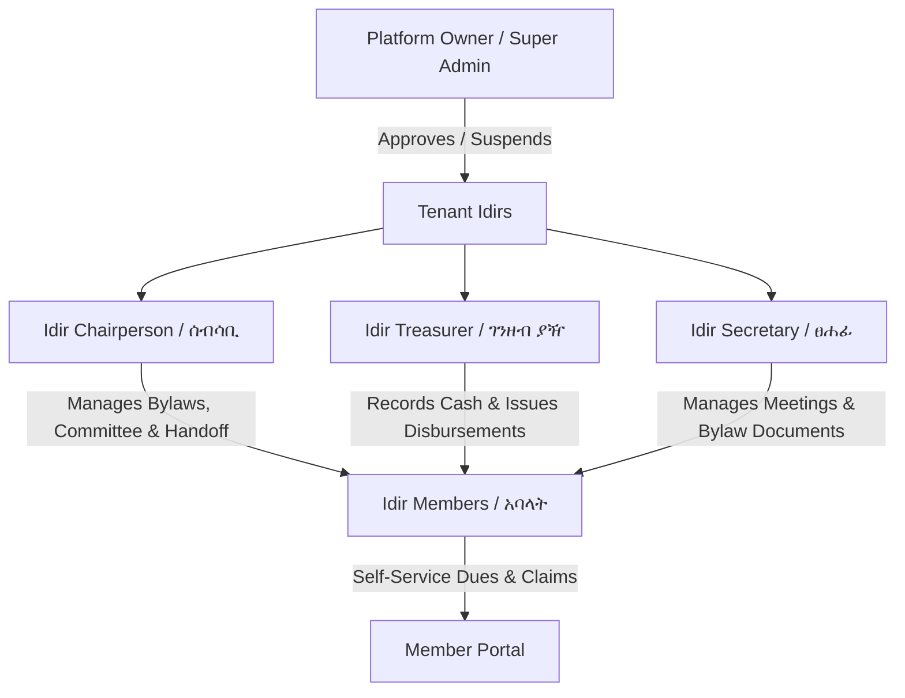
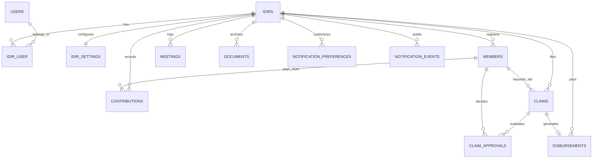

# Idir Management Platform (Ethiopia) — ዲጂታል የእድር መድረክ

<p align="center">
  <a href="https://laravel.com" target="_blank">
    
  </a>
</p>

<p align="center">
  <strong>A Sovereign, Multi-Tenant Financial SaaS & Governance Platform for Ethiopian Mutual-Aid Associations (እድር)</strong>
</p>

<p align="center">
  
  
  
  
  
  
  
</p>

---

## 📑 Table of Contents

- [1. Project Overview](#1-project-overview)
- [2. Problem Statement](#2-problem-statement)
- [3. Why This Project Exists](#3-why-this-project-exists)
- [4. Key Features](#4-key-features)
- [5. Visual Tour & Screenshots](#5-visual-tour--screenshots)
- [6. User Roles & Governance Hierarchy](#6-user-roles--governance-hierarchy)
- [7. System Architecture](#7-system-architecture)
- [8. Tech Stack](#8-tech-stack)
- [9. Database Design & Entity Relationships](#9-database-design--entity-relationships)
- [10. API & Webhook Specifications](#10-api--webhook-specifications)
- [11. Getting Started & Installation](#11-getting-started--installation)
- [12. Environment Variables](#12-environment-variables)
- [13. Running Locally & Development Services](#13-running-locally--development-services)
- [14. Automated Testing & Verification](#14-automated-testing--verification)
- [15. Production Deployment & Daemon Configuration](#15-production-deployment--daemon-configuration)
- [16. CI/CD Pipeline](#16-cicd-pipeline)
- [17. Security, Integrity & Compliance](#17-security-integrity--compliance)
- [18. Contributing Guidelines](#18-contributing-guidelines)
- [19. Roadmap](#19-roadmap)
- [20. Frequently Asked Questions (FAQ)](#20-frequently-asked-questions-faq)
- [21. License & Acknowledgements](#21-license--acknowledgements)

---

## 1. Project Overview

The **Idir Management Platform (ዲጂታል የእድር መድረክ)** is a purpose-built, multi-tenant software-as-a-service (SaaS) and community governance system designed specifically for Ethiopian mutual-aid burial and welfare societies (*idirs* / *እድሮች*). 

Traditional idirs form the foundational bedrock of civic mutual insurance across Ethiopia, organizing millions of households to provide financial assistance, emergency welfare, funeral coverage, and social solidarity. Despite managing billions of Ethiopian Birr (ETB), the vast majority of idirs still operate on fragile physical paper notebooks, manual cash handoffs, and informal record-keeping.

This platform modernizes idir governance without altering its sacred communal essence:
- **Multi-Tenant Scoping**: Every idir operates in strict cryptographic and tenant-level isolation with custom bylaws, frequencies, and dues.
- **Strict Immutable Double-Entry Ledger**: No financial record can be updated or deleted. Corrections are strictly offsetting entries (`is_correction = true`).
- **Democratic Multi-Approver Payouts**: Payouts require customizable consensus thresholds ($N$ approvals) among elected committee members.
- **National Fintech & Digital ID Integrations**: Seamlessly integrated with **Chapa** (Telebirr, CBE Birr), **AfroMessage SMS**, **Telegram Bot**, and Ethiopia's **Fayda eSignet National Digital ID** (RFC 7523 private_key_jwt).
- **Amharic-First Localization**: Native Ge'ez typography (`Noto Sans Ethiopic`) with full Amharic and English interfaces.

---

## 2. Problem Statement

Across Addis Ababa and regional Ethiopian communities, over 95% of idirs face severe operational challenges:
1. **Paper Notebook Fragility**: Ledger books are lost to water damage, theft, or misplacement, resulting in disputed records of who paid dues and who owes arrears.
2. **Embezzlement & Financial Opaque Governance**: Cash collections by treasurers frequently suffer from lack of audit trails, unverified expenditures, and arithmetic discrepancies.
3. **Delayed Crisis Relief**: When bereavement occurs, grieving families often wait days for committee members to physically assemble, verify standing, and locate physical cash.
4. **Member Alienation in Modern Workplaces**: Diaspora members and young urban professionals who rely on Telebirr or CBE Birr find physical monthly attendance difficult, resulting in inadvertent exclusion.
5. **Lack of Legal & Identity Verification**: Fraudulent claims or unverified ghost members compromise community trust.

---

## 3. Why This Project Exists

This platform was engineered as an open, auditable public infrastructure project to:
- **Protect Communal Wealth**: Guarantee that community savings are mathematically immutable, auditable, and safeguarded by strict multi-signature committee approval rules.
- **Bridge Traditional Trust with Modern Fintech**: Allow Ethiopian elders to verify payments through printed physical receipts, SMS alerts, and phone lookups, while enabling younger generations to pay through digital wallets (Telebirr, CBE Birr) via Chapa.
- **Enforce Separation of Concerns**: Differentiate between the overarching platform owner (Super Admin), autonomous elected idir committees (Chair, Treasurer, Secretary), and rank-and-file members.
- **Provide Zero-Vendor Lock-in**: Engineered with standard PHP 8.4, Laravel 13, Filament v5, and open database standards.

---

## 4. Key Features

| Category | Feature | Code Verification / Implementation Details |
| :--- | :--- | :--- |
| **Accounting** | **Immutable Ledger** | `sum(contributions) - sum(disbursements)`. Direct SQL `UPDATE` and `DELETE` queries are disabled via `ContributionPolicy`. Errors must be corrected with offsetting records (`is_correction = true`). |
| **Governance** | **Dynamic Bylaws & Rules** | Dues amounts, frequencies (weekly, monthly, quarterly, annual), late fees, grace periods, and vesting days are stored as configuration data in `idir_settings`, never hardcoded. |
| **Claims** | **Multi-Approver Consensus** | Configurable approval thresholds ($N$ approvers). Single rejection closes the claim immediately with mandatory remarks. Deciding approval establishes final disbursement amount. |
| **Payments** | **Chapa Digital Gateway** | Webhook listener with HMAC-SHA256 signature verification (`x-chapa-signature`), automated exponential retry backoff job (`ProcessChapaWebhookJob`), and local mock sandbox. |
| **Identity** | **Fayda Digital ID (eSignet)** | RFC 7523 `private_key_jwt` OIDC client authentication using RS256 token exchange (`FaydaOidcService`). Non-blocking national ID binding. |
| **Notifications** | **AfroMessage SMS & Telegram** | Automated SMS delivery with Ethiopian phone normalization (`+2519...`, `+2517...`) and shared Telegram Bot linking (`/start <phone>`). |
| **Multi-Tenancy** | **Filament v5 Isolation** | Distinct tenant paths (`/committee/{tenant}/...`), tenant registration wizard (`RegisterIdir`), tenant profile editor (`EditIdirProfile`), and strict model scoping. |
| **Security** | **Platform Owner Boundary** | Super Admins (`/admin`) approve and suspend idir tenants but are cryptographically and policy-blocked from viewing or altering private member financial records. |
| **Member Portal** | **Self-Service & Status Lookup** | Responsive glassmorphic portal with 4-stage claim tracker, printable official receipts (`/member/receipt/{id}`), and unauthenticated phone status check (`/member/lookup`). |
| **Realtime** | **Laravel Reverb Broadcasting** | Instantaneous private WebSocket channel broadcasts (`idir.{idirId}`) on contribution recording and claim status changes. |

---

## 5. Visual Tour & Screenshots

Verified end-to-end interface screenshots located in the [`screenshots/`](screenshots/) directory:

| View | Screenshot File | Description |
| :--- | :--- | :--- |
| **Public Landing Page** | [`screenshots/10_redesigned_landing_desktop.png`](screenshots/10_redesigned_landing_desktop.png) | Responsive Ethiopian landing page with traditional motifs, features, and public portal entry. |
| **Mobile Member Portal** | [`screenshots/11_redesigned_landing_mobile.png`](screenshots/11_redesigned_landing_mobile.png) | Mobile-first viewport demonstrating responsive bottom navigation and Amharic typography. |
| **Public Phone Lookup** | [`screenshots/13_member_lookup_result.png`](screenshots/13_member_lookup_result.png) | Instant standing lookup by phone number displaying active status, recent payments, and arrears. |
| **Chair Handoff Modal** | [`screenshots/06_chair_handoff_modal.png`](screenshots/06_chair_handoff_modal.png) | Safe leadership transfer workflow ensuring an idir is never left without an active Chairperson. |
| **Preserved Ledger History** | [`screenshots/05_ledger_preserved_history.png`](screenshots/05_ledger_preserved_history.png) | Audit trail demonstrating immutable records and negative offsetting correction entries. |
| **Platform Owner Boundary** | [`screenshots/09_platform_owner_readonly_boundary.png`](screenshots/09_platform_owner_readonly_boundary.png) | Super Admin view showing tenant oversight without access to private member records. |

---

## 6. User Roles & Governance Hierarchy

The platform implements a multi-tier governance model:



### Detailed Role Matrix

| Role | Access URL | Core Permissions & Responsibilities | Restrictions |
| :--- | :--- | :--- | :--- |
| **Platform Owner (Super Admin)** | `/admin` | Approves or rejects new idir tenant registrations; monitors aggregate platform statistics; suspends or reactivates non-compliant tenants. | **Strictly blocked** by `MemberPolicy` from editing idir member details, altering bylaws, or accessing tenant funds. |
| **Chairperson (ሰብሳቢ)** | `/committee/{tenant}` | Full executive authority: edits idir settings/bylaws, changes committee roles, initiates chairperson handoff, deactivates members, approves claims. | Cannot delete members (preserves ledger integrity); cannot demote self without handoff if sole chair. |
| **Treasurer (ገንዘብ ያዥ)** | `/committee/{tenant}` | Financial custodian: records manual cash contributions, posts offsetting ledger corrections, issues approved disbursements, reviews claims. | Cannot alter idir bylaws or membership vesting rules. Cannot delete contributions. |
| **Secretary (ፀሐፊ)** | `/committee/{tenant}` | Documentation & records: logs General Assembly/Executive meeting minutes, uploads official bylaws, reviews claims, issues member warnings. | Cannot record financial disbursements or alter dues amounts. |
| **General Member (አባል)** | `/member` | Accesses personal dashboard, views dues history, downloads printable receipts, submits payout claims with supporting documents, links Fayda ID. | Read-only access to idir finances. Cannot view other members' contributions or records. |
| **Guest / Public** | `/`, `/member/lookup` | Registers new user account with phone OTP, initiates new idir onboarding wizard, checks personal standing via public phone lookup. | No administrative or internal access. |

---

## 7. System Architecture

```mermaid
flowchart TB
    subgraph Client Layer
        M_BROWSER[Member Browser / Mobile]
        C_BROWSER[Committee Browser / Desktop]
        PUB_CLIENT[Public / Lookup]
    end

    subgraph Presentation & Routing Layer
        ROUTE_WEB[web.php / Route Middleware]
        ROUTE_API[api.php / Sanctum API]
        FIL_ADMIN[Filament Admin Panel: /admin]
        FIL_COMM[Filament Committee Panel: /committee/{tenant}]
        PORTAL[Member Portal Controller]
    end

    subgraph Service & Domain Layer
        LEDGER_SVC[LedgerService: Immutable Ledger & Balance Recalculation]
        CHAPA_SVC[ChapaService: Telebirr / CBE Birr Gateway]
        FAYDA_SVC[FaydaOidcService: eSignet OIDC RFC 7523]
        AFRO_SVC[AfroMessageService: Ethiopian SMS Gateway]
        TELE_SVC[TelegramService: Bot Webhook & Alerts]
        OTP_SVC[OtpService: Phone Verification]
    end

    subgraph Async & Background Processing Layer
        HORIZON[Laravel Horizon / Redis Queue]
        JOB_CHAPA[ProcessChapaWebhookJob]
        JOB_NOTIF[SendNotificationJob]
        REVERB[Laravel Reverb: Realtime WebSockets]
    end

    subgraph Persistence Layer
        DB[(PostgreSQL / SQLite: 18 Tables)]
        STORAGE[Local / S3 Document Store]
    end

    M_BROWSER --> PORTAL
    C_BROWSER --> FIL_COMM
    PUB_CLIENT --> ROUTE_WEB

    FIL_COMM --> LEDGER_SVC
    PORTAL --> LEDGER_SVC
    PORTAL --> CHAPA_SVC
    PORTAL --> FAYDA_SVC

    ROUTE_WEB -->|Webhook Callback| JOB_CHAPA
    JOB_CHAPA --> HORIZON
    HORIZON --> JOB_NOTIF
    JOB_NOTIF --> AFRO_SVC
    JOB_NOTIF --> TELE_SVC

    LEDGER_SVC --> REVERB
    LEDGER_SVC --> DB
    FIL_COMM --> STORAGE
```

---

## 8. Tech Stack

- **Backend Framework**: Laravel 13.x (PHP 8.4)
- **Administration & Tenancy**: Filament v5.7 (Livewire 3, Alpine.js)
- **Database Engine**: PostgreSQL 16+ (Production) / SQLite 3 (Development & CI)
- **API & Authentication**: Laravel Sanctum (Bearer Tokens), Session Auth, RFC 7523 `private_key_jwt` (Fayda OIDC)
- **Queue Supervisor**: Laravel Horizon 5.x & Redis
- **Realtime Broadcasting**: Laravel Reverb 1.x WebSockets
- **Styling & CSS**: Tailwind CSS v4.0 with `@tailwindcss/vite`
- **Typography & Localization**: Amharic-first (`lang/am/`), English (`lang/en/`), Google Fonts (`Noto Sans Ethiopic` & `Plus Jakarta Sans`)
- **Automated Testing**: PHPUnit 12.x, Mockery, Playwright E2E verification suite

---

## 9. Database Design & Entity Relationships

The database schema enforces data integrity through foreign keys, strict cascade policies, and unique constraints.



### Key Relational Constraints
- `claim_approvals`: Unique composite constraint `['claim_id', 'approver_member_id']` prevents double-voting by committee members.
- `contributions`: Nullable `corrected_contribution_id` self-references the original contribution when `is_correction = true`.
- `members`: Unique constraint on `['idir_id', 'phone']` prevents duplicate member profiles within the same idir.

---

## 10. API & Webhook Specifications

### 1. Mobile & External Client Endpoints (`routes/api.php`)

| Method | Endpoint | Auth / Middleware | Description |
| :--- | :--- | :--- | :--- |
| `POST` | `/api/auth/token` | `throttle:30,1` | Generates a Sanctum plainTextToken using Ethiopian phone/email + password. |
| `GET` | `/api/user` | `auth:sanctum`, `throttle:120,1` | Returns authenticated user profile and associated idir memberships. |
| `GET` | `/api/member/profile` | `auth:sanctum`, `throttle:120,1` | Retrieves full member profile with idir settings. |
| `GET` | `/api/member/contributions` | `auth:sanctum`, `throttle:120,1` | Returns member's full contribution history. |
| `GET` | `/api/member/claims` | `auth:sanctum`, `throttle:120,1` | Returns submitted claims with trigger types and committee approval records. |

### 2. Payment & Integration Webhooks

#### Chapa Digital Payment Webhook (`POST /api/chapa/webhook`)
- **Headers Verified**: `x-chapa-signature` (HMAC-SHA256 signature generated with `CHAPA_WEBHOOK_SECRET`).
- **Rate Limit**: `throttle:60,1`.
- **Behavior**: Verifies signature, validates `tx_ref`, and dispatches `ProcessChapaWebhookJob` to the Redis queue for server-side verification with exponential backoff (`[10, 30, 60, 120, 300]s`).

#### Telegram Bot Webhook (`POST /api/telegram/webhook`)
- **Headers Verified**: `X-Telegram-Bot-Api-Secret-Token` matching `TELEGRAM_WEBHOOK_SECRET`.
- **Rate Limit**: `throttle:60,1`.
- **Behavior**: Handles `/start <phone>` commands to link member profiles with their Telegram Chat ID for instant alerts.

---

## 11. Getting Started & Installation

### Prerequisites
- **PHP**: 8.4 or higher (`pdo`, `mbstring`, `intl`, `bcmath`, `curl`, `json`, `sqlite3` or `pgsql`)
- **Composer**: 2.7+
- **Node.js**: 20+ & npm
- **Redis**: 7.x (for Horizon and queue processing in production)

### Step-by-Step Installation

```bash
# 1. Clone the repository
git clone https://github.com/your-org/idir.git
cd idir

# 2. Install PHP and JavaScript dependencies
composer install
npm install

# 3. Configure environment file
cp .env.example .env
php artisan key:generate

# 4. Run database migrations with sample Ethiopian test data
php artisan migrate:fresh --seed

# 5. Build frontend assets
npm run build
```

---

## 12. Environment Variables

Key parameters configured in `.env.example`:

```dotenv
APP_NAME="እድር (Idir Management Platform)"
APP_ENV=local
APP_KEY=base64:...
APP_TIMEZONE="Africa/Addis_Ababa"
APP_LOCALE=am
APP_FALLBACK_LOCALE=en

# Database Configuration
DB_CONNECTION=sqlite
# For PostgreSQL in Production:
# DB_CONNECTION=pgsql
# DB_HOST=127.0.0.1
# DB_PORT=5432
# DB_DATABASE=idir_db
# DB_USERNAME=postgres
# DB_PASSWORD=secret

# Queue & Cache (Redis recommended for production)
QUEUE_CONNECTION=database
CACHE_STORE=database
REDIS_HOST=127.0.0.1
REDIS_PORT=6379

# Chapa Payment Gateway (Ethiopia)
CHAPA_BASE_URL=https://api.chapa.co/v1
CHAPA_PUBLIC_KEY=CHAPUBK_TEST-xxxxxxxx
CHAPA_SECRET_KEY=CHASECK_TEST-xxxxxxxx
CHAPA_WEBHOOK_SECRET=your_chapa_webhook_secret

# AfroMessage SMS Gateway
AFROMESSAGE_BASE_URL=https://api.afromessage.com/api
AFROMESSAGE_TOKEN=your_afromessage_token
AFROMESSAGE_SENDER_ID=IDIR

# Telegram Bot
TELEGRAM_BOT_TOKEN=your_bot_token
TELEGRAM_BOT_USERNAME=idir_bot
TELEGRAM_WEBHOOK_SECRET=your_secret_token

# Fayda Digital ID (eSignet OIDC)
FAYDA_BASE_URL=https://esignet.ida.fayda.et
FAYDA_CLIENT_ID=your_fayda_client_id
FAYDA_REDIRECT_URI="${APP_URL}/auth/fayda/callback"
FAYDA_PRIVATE_KEY_PATH="${storage_path}/keys/fayda_private.key"

# Laravel Reverb Realtime WebSockets
BROADCAST_CONNECTION=reverb
REVERB_APP_ID=idir-app
REVERB_APP_KEY=idir-app-key
REVERB_APP_SECRET=idir-app-secret
REVERB_HOST="localhost"
REVERB_PORT=8080
REVERB_SCHEME=http
```

---

## 13. Running Locally & Development Services

### Starting Local Services

```bash
# Terminal 1: HTTP Application Server
php artisan serve

# Terminal 2: Asset Watcher (Vite)
npm run dev

# Terminal 3: Background Worker / Horizon
php artisan horizon

# Terminal 4: Realtime Reverb WebSocket Server
php artisan reverb:start
```

### Seeded Credentials for Testing

| Persona / Portal | URL | Username / Identifier | Password | Role |
| :--- | :--- | :--- | :--- | :--- |
| **Super Admin** | `http://localhost:8000/admin` | `owner@idir-platform.et` | `password` | Platform Owner |
| **Idir Chairperson** | `http://localhost:8000/committee` | `chair@idir.et` | `password` | Chair (*ሰላም እድር*) |
| **Idir Treasurer** | `http://localhost:8000/committee` | `treasurer@idir.et` | `password` | Treasurer |
| **Idir Secretary** | `http://localhost:8000/committee` | `secretary@idir.et` | `password` | Secretary |
| **Member Portal** | `http://localhost:8000/member` | `0911778899` or `0922445566` | `password` | General Member |
| **Public Phone Lookup** | `http://localhost:8000/member/lookup` | `0911778899` | *(No password)* | Unauthenticated |

---

## 14. Automated Testing & Verification

The repository contains an automated test suite verifying business logic, financial math, and security policies:

```bash
# Execute entire test suite
php artisan test

# Run specific feature suites
php artisan test tests/Feature/LedgerTest.php
php artisan test tests/Feature/ClaimApprovalTest.php
php artisan test tests/Feature/PolicyAndWebhookSecurityTest.php
php artisan test tests/Feature/HttpTenantIsolationTest.php
```

### Test Coverage Highlights
- `LedgerTest`: Proves immutable double-entry calculations and offsetting negative correction balances.
- `ClaimApprovalTest`: Verifies $N$-approver thresholds, single-rejection termination, and deciding-approval payout derivation.
- `PolicyAndWebhookSecurityTest`: Verifies HMAC signature checking and validates that Platform Owners cannot access or mutate idir member records.
- `TenantIsolationTest`: Confirms that committee members from one idir cannot view or access data in another idir tenant.

---

## 15. Production Deployment & Daemon Configuration

### 1. Supervisor Daemon Configuration
In production, run **Horizon** and **Reverb** under system `supervisor` control.

`/etc/supervisor/conf.d/idir-horizon.conf`:
```ini
[program:idir-horizon]
process_name=%(program_name)s
command=php /var/www/idir/artisan horizon
autostart=true
autorestart=true
user=www-data
redirect_stderr=true
stdout_logfile=/var/www/idir/storage/logs/horizon.log
stopwaitsecs=3600
```

`/etc/supervisor/conf.d/idir-reverb.conf`:
```ini
[program:idir-reverb]
process_name=%(program_name)s
command=php /var/www/idir/artisan reverb:start
autostart=true
autorestart=true
user=www-data
redirect_stderr=true
stdout_logfile=/var/www/idir/storage/logs/reverb.log
```

### 2. Scheduled Cron Jobs
Add the Laravel schedule runner to the server crontab (`crontab -e -u www-data`):
```cron
* * * * * cd /var/www/idir && php artisan schedule:run >> /dev/null 2>&1
```
Automated tasks scheduled in `routes/console.php`:
- `idir:expire-pending-payments`: Runs hourly to expire pending digital payments older than 24 hours.
- `idir:check-arrears`: Runs daily to evaluate member payment status against idir grace periods and tag members in arrears.

---

## 16. CI/CD Pipeline

The GitHub Actions pipeline (`.github/workflows/ci.yml`) executes on every push and pull request to `main`, `master`, and `develop`:
1. Sets up PHP 8.4 with required extensions (`bcmath`, `intl`, `pdo_sqlite`, etc.).
2. Installs Composer dependencies with optimization flags.
3. Generates application encryption keys and prepares SQLite test database.
4. Executes migrations and runs PHPUnit test suite.
5. Performs route caching and configuration smoke tests (`php artisan config:cache`, `php artisan route:list`).

---

## 17. Security, Integrity & Compliance

1. **Immutable Financial History**: Direct `UPDATE` and `DELETE` on contributions are blocked at the Eloquent policy level (`ContributionPolicy`).
2. **Dual-Custodian Document Destruction**: Deleting an archived idir document requires two distinct committee members (`request_deletion` by member A, `confirm_deletion` by member B).
3. **Strict Webhook Authentication**: External webhooks (Chapa and Telegram) verify cryptographic signatures and secret header tokens before processing.
4. **Tenant Isolation Enforcement**: Requests to `/committee/{tenant}/...` verify that the authenticated user belongs to the requested idir tenant.
5. **Rate Limiting Defenses**: Public endpoints (login, self-service registration, phone lookup, OTP verification) enforce strict per-minute rate limits.

---

## 18. Contributing Guidelines

Contributions from developers and civic technocrats are welcome:
1. Fork the repository and create a feature branch (`git checkout -b feature/amharic-reporting`).
2. Adhere to PSR-12 coding standards. Format code with Laravel Pint (`./vendor/bin/pint`).
3. Ensure all tests pass (`php artisan test`). Add new tests for novel functionality.
4. Submit a Pull Request detailing the changes and linking relevant issues.

---

## 19. Roadmap

- [x] Multi-Tenant Filament v5 Panel with Amharic-first UI
- [x] Immutable Double-Entry Ledger with Offsetting Corrections
- [x] Chapa Payment Integration (Telebirr / CBE Birr) & Webhook Verification
- [x] Multi-Approver Claim & Payout Workflow
- [x] Fayda Digital ID (eSignet OIDC) Integration
- [x] Laravel Reverb Real-Time WebSocket Ledger Updates
- [ ] Offline PWA Mode for Rural Areas with Limited Internet
- [ ] Multi-Language Expansion (Afaan Oromoo, Tigrinya, Somali)
- [ ] Automated PDF Annual Financial Report Generation for General Assembly Meetings

---

## 20. Frequently Asked Questions (FAQ)

#### Q: Can a platform owner access my idir's savings or edit member accounts?
**A:** No. Architectural boundaries in `MemberPolicy` explicitly block Super Admins from viewing individual member profiles or modifying financial records.

#### Q: How does the system handle erroneous dues entries?
**A:** In accordance with traditional Ethiopian accounting ethics and audit integrity, entries cannot be deleted. Treasurers post an offsetting correction record (`is_correction = true`) with an audit reason. The balance is dynamically recomputed.

#### Q: What happens if a committee member rejects a claim?
**A:** A single rejection with mandatory remarks immediately terminates the claim, setting its status to `Rejected`. It cannot be re-approved.

#### Q: Is the Fayda Digital ID mandatory for members?
**A:** No. Fayda verification is non-blocking. Members can participate fully using their verified Ethiopian phone number.

---

## 21. License & Acknowledgements

This software is open-source under the [MIT License](LICENSE).

### Acknowledgements
- Inspired by centuries of traditional Ethiopian mutual-aid society (*Idir / እድር*) wisdom.
- Built on [Laravel](https://laravel.com), [Filament](https://filamentphp.com), [Livewire](https://livewire.laravel.com), and [Tailwind CSS](https://tailwindcss.com).
- Integrations enabled by [Chapa Financial Technologies](https://chapa.co), [AfroMessage](https://afromessage.com), and the [National ID Program of Ethiopia (Fayda)](https://fayda.et).

